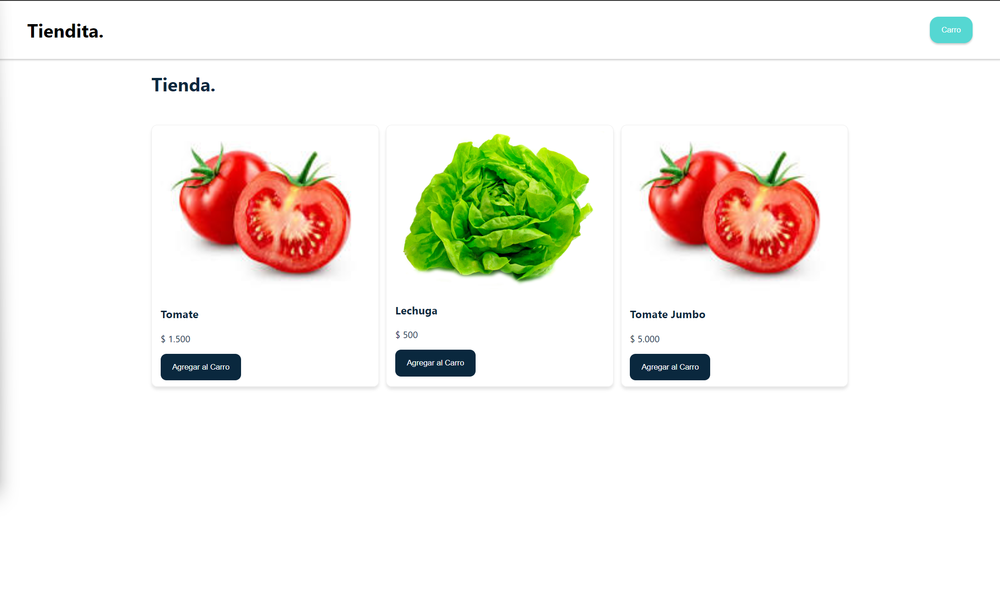
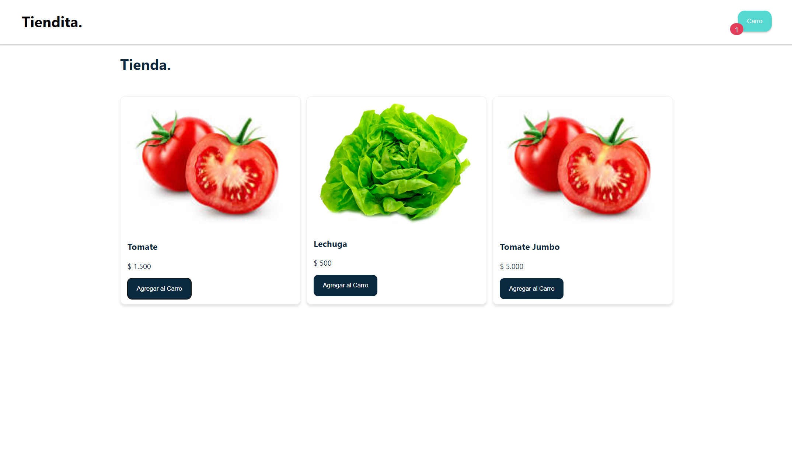
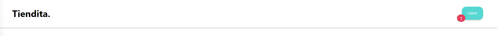
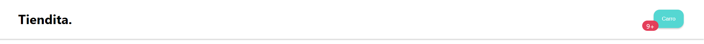
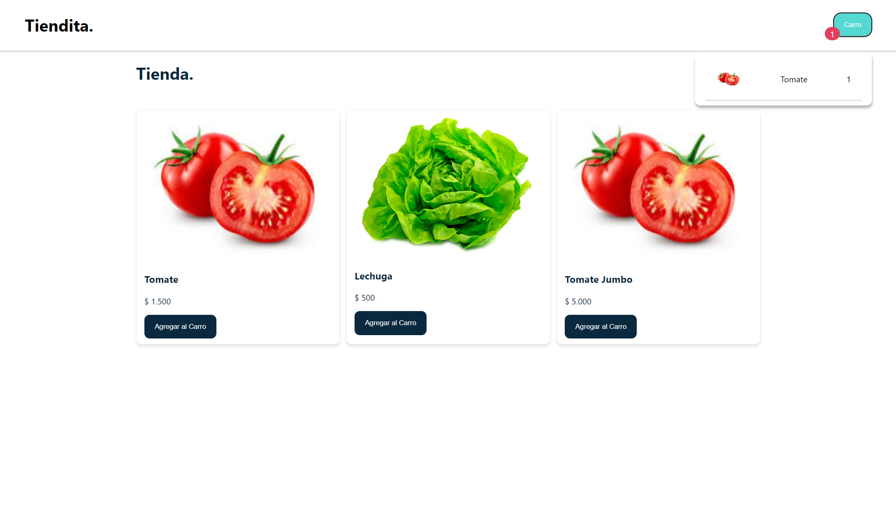
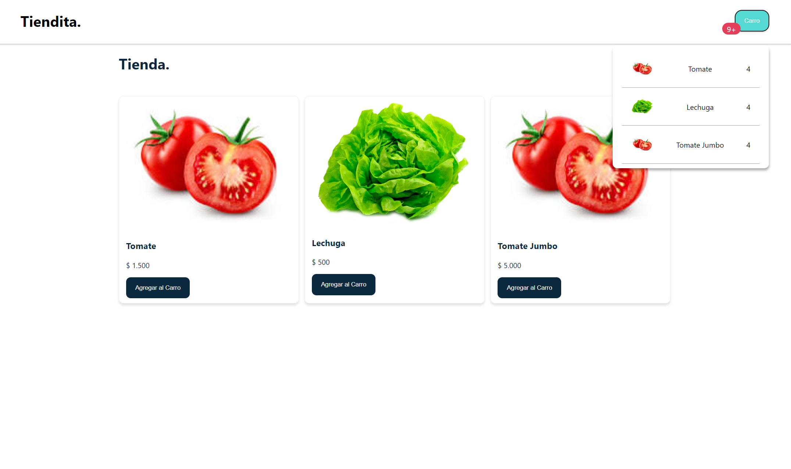

# Proyecto Carro de Compras.
- El proyecto consiste en un carro de compras que permite agregar productos al carro de compras 
- visualizar la cantidad de productos en el carro por medio de un boton 
- generar un icono que muestre la cantidad de productos hasta el numero 9 y luego mostrar un 9+

## Comenzando.
### Pantalla de inicio.

- al presionar el boton agregar al carro se agrega el producto al carro de compras y se muestra la cantidad de productos en el carro de compras.

### Agregando un producto.

### Carro con un producto agregado.

### Carro con mas de 9 productos agregados.

- al presionar el boton del carro de compras se muestra el listado de productos agregados al carro de compras.

### Mostrando mas de 9 productos agregados.
